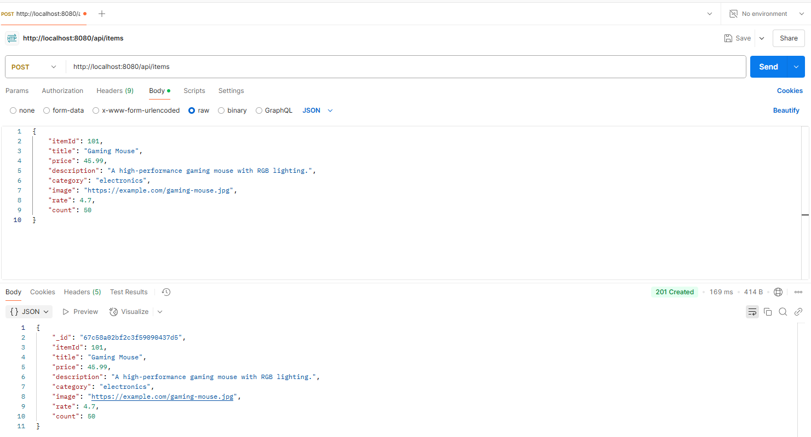
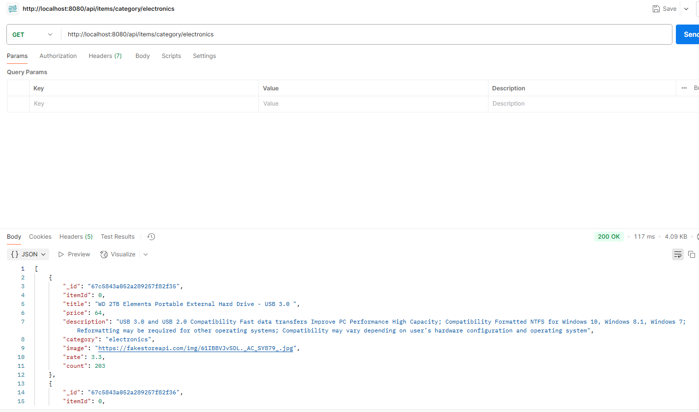

# Examen Acceso a Datos
## Endpoints de la API

### 1️⃣ Agregar un nuevo ítem
**Método:** `POST`  
**URL:** `http://localhost:8080/api/items`  
**Descripción:** Agrega un nuevo ítem a la tienda.  
**Headers:**
```
Content-Type: application/json
```
**Body (JSON):**
```json
{
    "itemId": 101,
    "title": "Gaming Mouse",
    "price": 45.99,
    "description": "A high-performance gaming mouse with RGB lighting.",
    "category": "electronics",
    "image": "https://example.com/gaming-mouse.jpg",
    "rate": 4.7,
    "count": 50
}
```
**Respuesta esperada:**
```json
{
    "id": "65f4d7c1b8e12a00123f4b01",
    "itemId": 101,
    "title": "Gaming Mouse",
    "price": 45.99,
    "description": "A high-performance gaming mouse with RGB lighting.",
    "category": "electronics",
    "image": "https://example.com/gaming-mouse.jpg",
    "rate": 4.7,
    "count": 50
}
```


### 2️⃣ Eliminar un ítem
**Método:** `DELETE`  
**URL:** `http://localhost:8080/api/items/delete/{id}`  
**Descripción:** Elimina un ítem existente de la tienda mediante su ID.

**Ejemplo:**
```
DELETE http://localhost:8080/api/items/delete/65f4d7c1b8e12a00123f4b01
```
**Respuesta esperada:**
```json
{
    "status": 204
}
```

### 3️⃣ Obtener los detalles de un ítem por ID
**Método:** `GET`  
**URL:** `http://localhost:8080/api/items/{id}`  
**Descripción:** Obtiene la información de un ítem específico en la tienda.

**Ejemplo:**
```
GET http://localhost:8080/api/items/65f4d7c1b8e12a00123f4a56
```
**Respuesta esperada:**
```json
{
    "id": "65f4d7c1b8e12a00123f4a56",
    "itemId": 1,
    "title": "Fjallraven - Foldsack No. 1 Backpack",
    "price": 109.95,
    "description": "Your perfect pack for everyday use and walks in the forest.",
    "category": "men's clothing",
    "image": "https://fakestoreapi.com/img/81fPKd-2AYL.jpg",
    "rate": 3.9,
    "count": 120
}
```

### 4️⃣ Listar los ítems por categoría
**Método:** `GET`  
**URL:** `http://localhost:8080/api/items/category/{category}`  
**Descripción:** Obtiene una lista de ítems pertenecientes a una categoría específica.

**Ejemplo:**
```
GET http://localhost:8080/api/items/category/electronics
```
**Respuesta esperada:**
```json
[
    {
        "id": "65f4d7c1b8e12a00123f4b02",
        "itemId": 102,
        "title": "Mechanical Keyboard",
        "price": 89.99,
        "description": "A high-quality mechanical keyboard with blue switches.",
        "category": "electronics",
        "image": "https://example.com/mechanical-keyboard.jpg",
        "rate": 4.5,
        "count": 30
    }
]
```


### 5️⃣ Cambiar la categoría de los ítems de una categoría específica
**Método:** `PATCH`  
**URL:** `http://localhost:8080/api/items/category/{category}?newCategory={newCategory}`  
**Descripción:** Modifica la categoría de todos los ítems que pertenecen a una categoría determinada.

**Ejemplo:**
```
PATCH http://localhost:8080/api/items/category/electronics?newCategory=gaming
```
**Respuesta esperada:**
```json
[
    {
        "id": "65f4d7c1b8e12a00123f4b02",
        "itemId": 102,
        "title": "Mechanical Keyboard",
        "price": 89.99,
        "description": "A high-quality mechanical keyboard with blue switches.",
        "category": "gaming",
        "image": "https://example.com/mechanical-keyboard.jpg",
        "rate": 4.5,
        "count": 30
    }
]
```

### 6️⃣ Mostrar estadísticas de la tienda
**Método:** `GET`  
**URL:** `http://localhost:8080/api/items/stats`  
**Descripción:** Muestra estadísticas generales de la tienda, incluyendo el número total de ítems y una lista de los ítems con una puntuación superior a una cantidad especificada.

**Ejemplo:**
```
GET http://localhost:8080/api/items/stats?minRate=4.5
```
**Respuesta esperada:**
```json
{
    "totalItems": 20,
    "highRatedItems": [
        {
            "id": "65f4d7c1b8e12a00123f4b01",
            "itemId": 101,
            "title": "Gaming Mouse",
            "price": 45.99,
            "description": "A high-performance gaming mouse with RGB lighting.",
            "category": "electronics",
            "image": "https://example.com/gaming-mouse.jpg",
            "rate": 4.7,
            "count": 50
        }
    ]
}
```